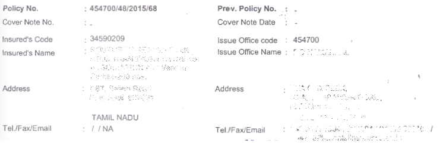
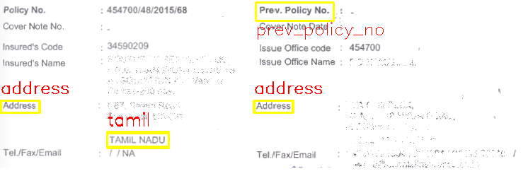
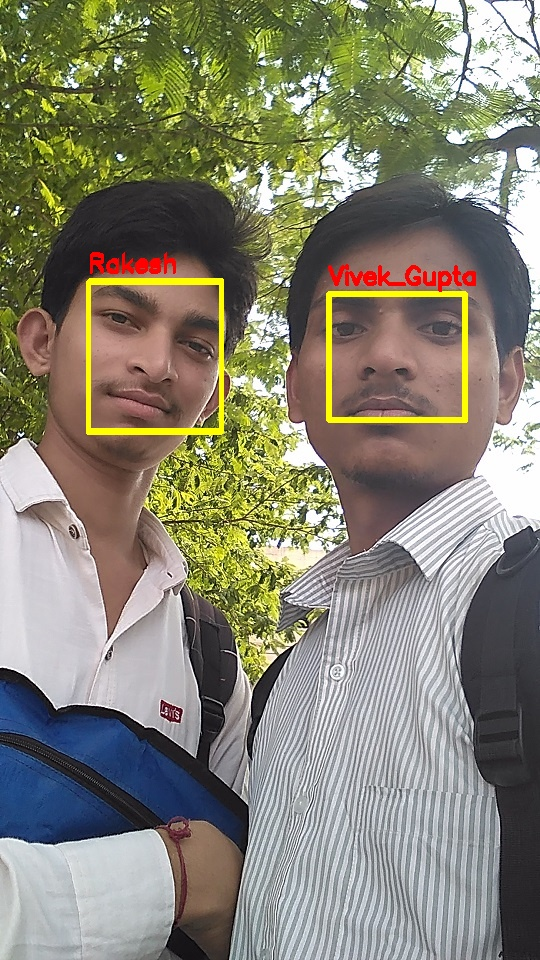

# Image-field-detection-using-template-matching-using-openCV
Here I implemented Image field detection using templated, which may be a part of Image or very similar is pattern, matching. The library provide this functionality is openCV.
References: GeeksforGeeks

**Pyhton file: TemplateDetection.py**

***The input Image used 1:-***

***Templates 1:-***

1. 
2. 
3. 
4. 

**Pyhton file: TemplateDetection_me.py**

***Output Image with detected fields 1:-***

***The input Image used 2:-***

***Templates 2:-***

1. 
2. 

***Output Image with detected fields 2:-***

